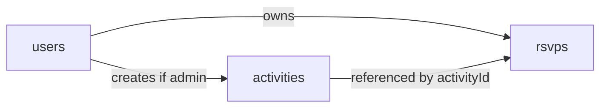

# Firestore data model (canonical)

This matches the deployed security rules and [`public/js/`](../public/js/) modules.

## `users`

- Document ID: Firebase Auth UID.
- Fields: `displayName`, `email`, `photoURL`, `role` (`user` | `admin`), `createdAt`.

## `activities`

- Document ID: auto-ID from `addDoc`, or fixed IDs when seeded.
- Fields: `title`, `description`, `location`, `date`, `time`, `displayTime`, `image`, `cost`, `goingCount` (optional), `active`, `createdBy`, `createdAt`, `updatedBy`, `updatedAt`.

## `rsvps`

- Document ID: `{uid}_{activityId}`.
- Fields: `ownerUid`, `activityId`, `status` (`going` | `not_going`), `updatedAt`.

## Relationships

